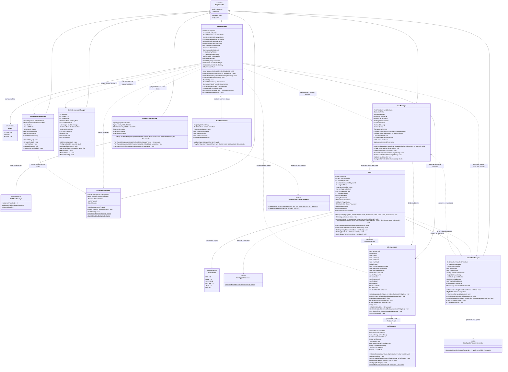

# Zeometry Slayer 클래스 다이어그램 (Class Diagram)

## 1. 전체 클래스 구조도 (Full Class Diagram)

```mermaid
classDiagram
    direction TB

    %% ==========================================
    %% 1. 기반 클래스 및 열거형 (Core & Enums)
    %% ==========================================
    class Singleton~T~ {
        <<abstract>>
        -static T instance
        +static T Ins$
        #Awake() void
        +Init() void
    }

    class ETurn {
        <<enumeration>>
        PLAYER = 1
        ENEMY = 2
        ATTACK = 3
    }

    class ECardColor {
        <<enumeration>>
        RED = 0
        BLUE = 1
        GREEN = 2
        BUSTER = 0
        ARTS = 1
        QUICK = 2
    }

    class EHitReactionStyle {
        <<enumeration>>
        HorizontalShakeOnly = 0
        ShakeWithFlashAndKnockback = 1
        CyberGlitchSplit = 2
    }

    class CardTypeExtensions {
        <<static>>
        +GetCardName(ECardColor cardColor)$ string
    }

    %% ==========================================
    %% 2. 전투 루프 및 매니저 그룹 (Managers)
    %% ==========================================
    class BattleManager {
        -ETurn currunt_Turn
        -int currentTurnNumber
        -TurnUIController turnUIController
        -List~SelectableUnit~ playerUnits
        -List~SelectableUnit~ enemyUnits
        -SelectableUnit selectedPlayer
        -SelectableUnit selectedEnemy
        -float selectedScaleMultiplier
        -float attackStepInterval
        -float enemyAttackInterval
        -int totalEnemyActions
        -int maxActionsPerEnemy
        -bool isAttackPhaseRunning
        -bool isBattleEnded
        +bool IsPlayerInputAllowed
        +SelectableUnit SelectedPlayer
        +SelectableUnit SelectedEnemy
        +ETurn CurrentTurn
        +OnUnitClicked(SelectableUnit clickedUnit) void
        +SelectPlayerUnit(SelectableUnit targetPlayer) void
        +SelectEnemyUnit(SelectableUnit targetEnemy) void
        +CheckAutoEndPlayerTurn() void
        +TurnEnd() void
        -CoStartPlayerTurn() IEnumerator
        -CoExecuteAttackPhase() IEnumerator
        -CoExecuteEnemyTurn() IEnumerator
        -IncrementAllTurnBuffs() void
        -BuildEnemyActionQueue() List~SelectableUnit~
        +EnsureSceneReferences() void
    }

    class HandManager {
        -RectTransform handContainer
        -Card cardPrefab
        -Vector2 cardSize
        -Sprite redCardSprite
        -Sprite blueCardSprite
        -Sprite greenCardSprite
        -int maxHandSize
        -float cardSpacing
        -float angleStep
        -float arcDropPerStep
        -Dictionary~int, List~ECardColor~~ playerHandData
        -Dictionary~int, SelectableUnit~ playerUnitMap
        -List~Card~ handCards
        -int currentSelectedPlayerIndex
        +int CurrentHandCount
        +int CurrentSelectedPlayerIndex
        +DealRandomHandsForAllPlayers(IReadOnlyList~SelectableUnit~ players) void
        +ShowPlayerHand(int playerIndex) void
        +SetHandVisibility(bool visible) void
        +DetachCardFromHand(Card targetCard) void
        +ReturnCardToHand(Card targetCard) void
        +UpdateHandLayout() void
        +GetSpriteForColor(ECardColor color) Sprite
    }

    class AttackBoxManager {
        -RectTransform boxRectTransform
        -int requiredCardCount
        -Vector2 boxCardSize
        -float leftPadding
        -float cardSpacing
        -Sprite[] orderNumberSprites
        -Image boxFrameImage
        -List~Card~ queuedCards
        +int CurrentCardCount
        +int RequiredCardCount
        +bool IsReadyToExecute
        +IReadOnlyList~Card~ QueuedCards
        +IsPointerOverBox(PointerEventData eventData) bool
        +TryAddCard(Card card) bool
        +ReturnCardToHand(Card card) void
        +DistributeStarsRandomly(int totalStars) void
        +ConsumeLeftmostCard(out ECardColor, out SelectableUnit, out int) bool
        +ClearAllQueuedCards() void
        +UpdateBoxLayout() void
    }

    class BattleResourceUIManager {
        -int maxCost
        -int currentCost
        -int currentStars
        -RectTransform costTrayRoot
        -Text costValueText
        -List~Image~ costGemImages
        -RectTransform starCounterRoot
        -Image starIconImage
        -Text starCountText
        +int MaxCost
        +int CurrentCost
        +int CurrentStars
        +AddCost(int amount) void
        +TrySpendCost(int amount) bool
        +AddStars(int amount) void
        +ConsumeAllStarsForAttackPhase() int
        +RefreshAllUI() void
        +RefreshCostUI() void
        +RefreshStarUI() void
    }

    class CombatEffectManager {
        -Sprite[] playerAuraSprites
        -Sprite enemyHitSlashSprite
        -EHitReactionStyle hitReactionStyle
        -float auraDuration
        -float slashDuration
        -float shakeDuration
        +PlayCardAttackSequence(SelectableUnit attacker, ECardColor color, SelectableUnit target) IEnumerator
        +PlayPlayerHitSequenceOnUnit(SelectableUnit targetPlayer) IEnumerator
        +PlayPlayerAttackAura(SpriteRenderer targetSr, ECardColor auraColor) void
        +PlayEnemyHit(SpriteRenderer targetEnemySr, float delay) void
    }

    class PauseMenuManager {
        -GameObject pauseOverlayPanel
        -RectTransform menuWindowRect
        -Button quitGameButton
        -bool isPaused
        +bool IsPaused
        +TogglePauseMenu() void
        +SetPauseMenuOpen(bool open) void
        +QuitGame() void
        +GetOrCreateWindowSprite()$ Sprite
        +GetOrCreateButtonSprite()$ Sprite
    }

    class BattleResultUIManager {
        -GameObject resultOverlayPanel
        -RectTransform resultWindowRect
        -Text titleText
        -Text subTitleText
        -Button actionButton
        -bool isResultShowing
        -bool isVictoryMode
        +bool IsResultShowing
        +ShowVictoryUI() void
        +ShowDefeatUI() void
        +HideResultUI() void
        +QuitApplication() void
        +RestartFromBeginning() void
    }

    %% ==========================================
    %% 3. 유닛, 카드 및 개별 UI 컴포넌트 (Entities & UI)
    %% ==========================================
    class SelectableUnit {
        -bool isPlayerUnit
        -int unitIndex
        -float maxHp
        -float currentHp
        -float minAttack
        -float maxAttack
        -int buffCount
        -bool incrementBuffEveryTurn
        -float selectedScaleMultiplier
        -float deathFadeDuration
        -UnitStatusUI statusUI
        +bool IsPlayerUnit
        +int UnitIndex
        +bool IsSelected
        +bool IsDead
        +float MaxHp
        +float CurrentHp
        +int BuffCount
        +Vector3 WorldBasePosition
        +InitializeUnit(bool isPlayer, int index, float scaleMultiplier) void
        +EnsureStatsConfigured(bool forceResetToDefault) void
        +CalculateAttackDamage() float
        +IncrementTurnBuff(int amount) void
        +TakeDamage(float damage) bool
        -Die() void
        -CoFadeOutAndDie() IEnumerator
        +SetSelected(bool selected, float customScaleMultiplier) void
        +OnPointerClick(PointerEventData eventData) void
        +RefreshStatusUI() void
    }

    class UnitStatusUI {
        -SelectableUnit targetUnit
        -RectTransform rootRect
        -CanvasGroup canvasGroup
        -RectTransform hpFillRect
        -Image hpFillImage
        -Text hpValueText
        -RectTransform buffContainerRect
        -Image singleFeatherImage
        -Text buffExponentText
        -Vector3 worldOffset
        +Initialize(SelectableUnit unit, Sprite customFeatherSprite) void
        +UpdatePosition() void
        +RefreshStatus(float currentHp, float maxHp, int buffCount) void
        -RefreshFeatherBuffDisplay(int count) void
        +SetAlpha(float alpha) void
        +CreateFeatherTexture(int width, int height)$ Texture2D
    }

    class Card {
        -string cardName
        -ECardColor cardColor
        -int ownerPlayerIndex
        -SelectableUnit ownerPlayerUnit
        -int assignedStars
        -Image orderNumberImage
        -Text cardTypeLabelText
        -Text critStarBadgeText
        -int savedHandIndex
        -bool isInAttackBox
        +string CardName
        +ECardColor CardColor
        +int OwnerPlayerIndex
        +SelectableUnit OwnerPlayerUnit
        +bool IsInAttackBox
        +int AssignedStars
        +float CriticalChancePercent
        +SetupCard(int playerIdx, SelectableUnit owner, ECardColor color, Sprite sprite, int handIdx) void
        +SetAssignedStars(int stars) void
        +SetCardTransform(Vector2 pos, Quaternion rot, int siblingIdx) void
        +SetAttackBoxTransform(RectTransform parent, Vector2 pos, Vector2 size, int idx, Sprite orderSprite) void
        +OnPointerEnter(PointerEventData eventData) void
        +OnPointerExit(PointerEventData eventData) void
        +OnBeginDrag(PointerEventData eventData) void
        +OnDrag(PointerEventData eventData) void
        +OnEndDrag(PointerEventData eventData) void
    }

    class TurnUIController {
        -Image topLeftTurnImage
        -RectTransform centerBannerRect
        -Image centerBannerImage
        -float centerHoldDuration
        -float slideInDuration
        -float slideOutDuration
        +float CenterHoldDuration
        +UpdateTopLeftStatus(ETurn turn) void
        +PlayTurnTransitionRoutine(ETurn turn, float overrideHoldDuration) IEnumerator
    }

    %% ==========================================
    %% 4. 절차적 텍스처 생성 유틸리티 (Procedural Generators)
    %% ==========================================
    class CombatEffectTextureGenerator {
        <<static>>
        +CreatePlayerCommonAuraTexture(ECardColor colorType, int size)$ Texture2D
        +CreateSimpleHitSlashTexture(int size)$ Texture2D
    }

    class GoldNumberTextureGenerator {
        <<static>>
        +CreateGoldNumberTexture(int number, int width, int height)$ Texture2D
    }

    %% ==========================================
    %% 상속 관계 (Inheritance)
    %% ==========================================
    Singleton~T~ <|-- BattleManager
    Singleton~T~ <|-- HandManager
    Singleton~T~ <|-- AttackBoxManager
    Singleton~T~ <|-- BattleResourceUIManager
    Singleton~T~ <|-- CombatEffectManager
    Singleton~T~ <|-- PauseMenuManager
    Singleton~T~ <|-- BattleResultUIManager

    %% ==========================================
    %% 연관 및 의존 관계 (Associations & Dependencies)
    %% ==========================================
    BattleManager --> ETurn : manages phase
    BattleManager "1" --> "1" TurnUIController : controls banner & status
    BattleManager "1" --> "3..6" SelectableUnit : manages players & enemies
    BattleManager ..> HandManager : deals hands & toggles visibility
    BattleManager ..> AttackBoxManager : distributes stars & consumes 6 cards
    BattleManager ..> BattleResourceUIManager : adds Cost/Stars & consumes Stars
    BattleManager ..> CombatEffectManager : plays attack aura & hit shake
    BattleManager ..> BattleResultUIManager : shows Victory / Defeat UI
    BattleManager ..> PauseMenuManager : checks IsPaused

    SelectableUnit "1" <--> "1" UnitStatusUI : updates HP bar & Feather^n buff
    SelectableUnit ..> BattleManager : notifies OnUnitClicked

    HandManager "1" o-- "0..6" Card : pools & arches hand cards
    HandManager ..> SelectableUnit : binds card owner

    AttackBoxManager "1" o-- "0..6" Card : queues up to 6 cards
    AttackBoxManager ..> HandManager : detaches / returns card
    AttackBoxManager ..> GoldNumberTextureGenerator : generates 1~6 sprites

    Card --> ECardColor : Buster / Arts / Quick
    Card --> SelectableUnit : references OwnerPlayerUnit
    Card ..> AttackBoxManager : drag & drop interaction
    Card ..> CardTypeExtensions : resolves card name

    CombatEffectManager --> EHitReactionStyle : uses shake mode
    CombatEffectManager ..> CombatEffectTextureGenerator : generates aura & slash

    BattleResultUIManager ..> PauseMenuManager : shares window/button sprites
```
